  <strong>Maithresh Vaddi</strong> · AI/ML Engineer · Generative AI · Agentic AI Systems 
  Hyderabad, India · B.Tech CSE, KMIT (2023–2027) · CGPA 7.96/10

  <a href="https://github.com/MaithreshVaddi-27"><code>github.com/<b>MaithreshVaddi-27</b></code></a>

  
  
  
  
  

> Seeking **AI/ML Engineering** roles. I design and ship **local-first agentic RAG systems** — hybrid retrieval, claim-level verification, self-healing recovery loops — plus multi-agent pipelines and workflow automation. Full architectural ownership; implementation deliberately accelerated with directed AI-orchestrated engineering (Claude Code, OpenCode, Antigravity).

**Contents** — [About](#about) · [Technical Skills](#technical-skills) · [Flagship: TrustRAG](#trustrag--local-first-rag-reliability-workbench) · [Agentic AI Projects](#agentic-ai-projects) · [Automation](#automation--workflow-engineering) · [Team Projects](#team-projects) · [More Builds](#more-builds) · [Education & Certifications](#education--certifications) · [Contact](#contact)

---

## About

<table>
<tr>
<td width="55%" valign="top">

Final-year **B.Tech CSE** undergrad at **KMIT Hyderabad** (CGPA **7.96/10**), building **agentic RAG systems** — hybrid dense + BM25 retrieval with RRF, NLI-based claim verification, MCP-based tool orchestration, LangGraph multi-agent workflows — outside coursework.

**10 solo repos**, an **n8n suite of 10 workflows**, 2 Make.com scenarios, 1 RPA bot, and **2 group AI platforms** with ML-integration ownership.

Currently hardening **TrustRAG** (budget-aware adaptive recovery, SAST + container-vulnerability CI gates) and moving **CareerOS-Pro** toward Docker-based deployment.

**Working principles:**
- Simple beats clever — rebuilt DocuChat from multi-agent to single-agent once the complexity stopped paying off.
- Ship it, don't demo it — every project below is a maintained repo with a README, not a one-off notebook.
- Abstain rather than guess — TrustRAG returns an explicit abstain when evidence doesn't support an answer.

</td>
<td width="45%">

</td>
</tr>
</table>

---

**KMIT, Hyderabad** — B.Tech CSE, 2023–2027 · CGPA **7.96/10**
DSA · OS · DBMS · Computer Networks · Software Engineering · Cloud Computing (AWS) · Cyber Security

---

## Technical Skills

**Languages** — Python, Java (OOP coursework), C++, JavaScript (ES6), SQL

**LLMs & GenAI** — Gemini API, NVIDIA NIM, LangChain, LangGraph (stateful agents, self-healing recovery loops, multi-provider routing), CrewAI, RAG, hybrid dense + sparse (BM25) retrieval, Reciprocal Rank Fusion, cross-encoder reranking, NLI-based claim verification, MCP (server + client, JSON-RPC 2.0, Composio), ReAct / Plan-Execute agents, conversational memory / checkpointing, ONNX Runtime (embeddings + reranking), HuggingFace embeddings (`bge-small-en-v1.5`, `bge-base-en-v1.5`, `all-mpnet-base-v2`), prompt engineering, local LLMs (Ollama, llama.cpp, MLX, LM Studio), LoRA / RLHF fundamentals

**AI-Orchestrated Engineering** — directing multi-agent AI coding tools (Claude Code, OpenCode, Antigravity) from detailed, self-written specifications. Full architectural and design ownership retained; implementation delegated deliberately.

**Backend & DB** — FastAPI (async, JWT, rate limiting), Granian, Flask, httpx (async), Pydantic, SQLAlchemy, Node.js, Express.js, MongoDB Atlas, MySQL, SQLite, Redis, Qdrant, ChromaDB

**Automation** — n8n, Make.com, Automation Anywhere (RPA), Webhooks, REST APIs

**AI / ML** — TensorFlow, Keras, Scikit-learn, YOLO, CNN / RNN / LSTM (academic coursework)

**Cloud & DevOps** — AWS (EC2, EFS, EBS, VPC, S3, Lambda, SNS, SQS, Elastic Beanstalk, Lex, IAM, DynamoDB — theory + hands-on labs); Render + Cloudflare Pages (TrustRAG deployed); Docker / Compose; Jenkins, Kubernetes (coursework + self-practice); CI/CD with pytest, ruff, Bandit SAST, Trivy container scanning; Git. *No production AWS deployment yet.*

**Testing & Reliability** — pytest, Vitest, Playwright (E2E), k6 (load), Bandit (SAST)

**Data & Analysis** — Pandas, NumPy, Matplotlib; 26 LeetCode SQL problems (joins, subqueries, aggregations)

<code>$ cat stack/other.md</code> — Frontend, design

 

- **Frontend** *(supporting skill, not target role)* — React (incl. React 19), HTML5, CSS3, Bootstrap 4.5, Framer Motion, Gradio
- **Design** — Figma (UX research, wireframing)

---

## TrustRAG — Local-First RAG Reliability Workbench

**Solo · Flagship** · [Repository](https://github.com/MaithreshVaddi-27/TrustRAG) · `FastAPI 0.115 · React 18 / Vite 6 · MongoDB 7 · Qdrant · LangGraph · ONNX Runtime · MCP (JSON-RPC 2.0)`

Specified end-to-end, then built via directed AI-orchestrated engineering — an 8-stage verification pipeline:

`route → hybrid retrieve → grounded generate → claim decompose → NLI verify → SHA-256 audit → adaptive recover → answer / abstain`

- **Local-first by default** — Ollama / llama.cpp / MLX inference, ONNX Runtime (torch-free) embeddings (`bge-small-en-v1.5`) + int8 cross-encoder reranking (`ms-marco-MiniLM-L-6-v2`). Optional Gemini / NVIDIA NIM fallback. No API keys required on the default path.
- **Claim-level verification** — per-claim NLI classification (SUPPORTED / CONTRADICTED / NEUTRAL), SHA-256 evidence-integrity audit with temporal-validity checks, budget-aware LangGraph recovery loop (rewrite → re-retrieve → regenerate, capped at 2 attempts).
- **Inference tuning** — KV-cache quantization (q4_0 / q8_0 / fp16), flash attention, prompt caching, speculative decoding, adaptive top-k, hierarchical context compression. Fully config-driven with env overrides.
- **Production surface** — JSON-RPC 2.0 MCP server (Claude Desktop / Cursor / Windsurf), hybrid dense + BM25 with RRF, SSRF-hardened URL validation, JWT auth (HS256, JTI revocation denylist) with bcrypt + login lockout, KB snapshots / rollback, Prometheus metrics, A/B experiment framework.
- **Verified** — 111 backend pytest + 15 Vitest + 2 Playwright E2E; k6 holds p95 latency under 300 ms.

## Agentic AI Projects

#### MCP Agentic DocuChat
**Solo · Agentic RAG for PDFs, CLI + Gradio** · [Repository](https://github.com/MaithreshVaddi-27/MCP_Agentic_DocuChat)
LangChain · LangGraph · ChromaDB · Gradio · Composio MCP · Ollama · llama.cpp

Evolved from CLI-only RAG (PyPDFLoader, RecursiveCharacterTextSplitter, `bge-base-en-v1.5`, stable content-hash IDs) into a Gradio web app with three swappable providers — Gemini, Ollama, llama.cpp (Qwen3-4B-GGUF) — each with readiness checks; original CLI (LangGraph checkpointing, `retrieve_multi`, `calculate`) kept as a standalone entry point. Provider-agnostic MCP routing via Composio, persistent SQLite history, stated-fact memory, bounded response cache, per-user rate limiting, exponential-backoff retries. Same labelled context package + grounding check on every provider, with automatic repair on ungrounded answers. Deliberately pulled back from multi-agent to single-agent.

#### CareerOS-Pro
**Solo · Multi-source job aggregation platform, in production hardening** · [Repository](https://github.com/MaithreshVaddi-27/CareerOS-Pro)
FastAPI / Granian · React 19 / Vite / Framer Motion · MySQL · Redis · Qdrant · LangGraph · Docker

Aggregates live listings from 5 job-board APIs (JSearch, Adzuna, Remotive, RemoteOK, Arbeitnow) plus a custom async career-page scraper (semaphore-controlled, backoff-and-jitter). Deterministic normalization — no LLM in the parsing path — with two-stage dedup (`url_hash`, `content_hash`) and hard eligibility filters enforced in code. LangGraph-routed multi-provider fallback (LlamaCpp → NVIDIA NIM → OpenRouter → Gemini), two-stage link verification (HEAD + Firecrawl scrape), Qdrant semantic ranking, live `GET /agents/health` per-agent observability. Containerized with Docker / Compose.

#### Resume Crew
**Solo · Local-first resume-to-JD matcher, CLI + Gradio** · [Repository](https://github.com/MaithreshVaddi-27/Resume_Crew)
CrewAI · Ollama · Gemini · Gradio · pytest

CrewAI pipeline over PDF / DOCX / TXT / Markdown producing a six-part evidence-only report (match score, profiles, skills gap, tailored bullets, interview prep — no invented experience). Gradio UI with 8 workflows (Analyze, Build Resume from source facts, Rank, Batch, Compare JDs, History with score-trend chart, Hardware diagnostics) + scriptable CLI. Local Ollama inference (CUDA / MPS auto-detect) with optional Gemini fallback; CrewAI telemetry disabled by default. pytest across six modules.

<code>$ ls agents/more/</code>

 

- **[AI Game Dev Crew](https://github.com/MaithreshVaddi-27/AI-Game-Dev-Crew)** — 3-agent CrewAI pipeline (Designer → Pygame Developer → QA), idea → playable 2D browser game (pygbag WASM + ngrok). Fixed an output-path collision that would have overwritten the launcher, and a pygbag async-loop freeze.
- **[MCP SkillMap Agent](https://github.com/MaithreshVaddi-27/MCP_SkillMap_Agent)** — Skill-to-career mapping over live job data (Tavily + JSearch via Composio), LangGraph memory checkpointing. Pinned a transitive `mcp>=2.0.0` break to keep builds reproducible.
- **[MCP SalaryInsights Agent](https://github.com/MaithreshVaddi-27/MCP_SalaryInsights_Agent)** — Live comp data (Glassdoor, AmbitionBox, PayScale, Levels.fyi) via Firecrawl MCP, answers grounded in scraped data with source URLs.
- **[MCP Email Inbox Summarizer](https://github.com/MaithreshVaddi-27/MCP_Email_Inbox_Summarizer)** — Gmail triage (URGENT / NEEDS REPLY / FYI). Drafts only via `GMAIL_CREATE_DRAFT` — never auto-sends.
- **[AI Blog Writing Crew](https://github.com/MaithreshVaddi-27/Ai-Blog-Writer-Crew)** — 3-agent CrewAI pipeline, topic → edited, timestamped Markdown post.
- **[MCP CourseFinder Agent](https://github.com/MaithreshVaddi-27/MCP_CourseFinder_Agent)** — Tavily (roadmaps, docs) + YouTube MCP merged into one structured learning path. No-hallucination grounding.

---

## Automation & Workflow Engineering

**[Ai-Workflow-Automations](https://github.com/MaithreshVaddi-27/Ai-Workflow-Automations)** — 10 n8n workflows, 2 Make.com scenarios, 1 Automation Anywhere RPA bot. Exports in linked Drive folders; repo holds docs and diagrams.

- **Shopping Assistant (agentic)** — Telegram text/voice in → Groq Whisper transcription → Gemini tool-using agent + scraper-API product search → per-chat Redis memory.
- **Learning Path Generator (agentic)** — chat → Gemini + SerpApi curriculum → new Google Doc + Calendar study blocks.
- **Internship Applier** — Sheets row → Gemini-drafted email → Gmail send.
- **LinkedIn Job Tracker** — daily RSS → skill extraction + cover-letter draft → new Sheet row.
- **News Summarizer / Weather Planner / Historical Publisher / Learning Showcase** — scheduled digests, forecast-day plans, LinkedIn posts, and an n8n port of the Make.com social pipeline (Sheets → Gemini → LinkedIn / X).

**[PodEase Pro](https://podease-pro.lovable.app)**  — Idea-to-audio pipeline: Lovable frontend → n8n webhook → Gemini (script) → Murf AI (TTS).

**Make.com suite** — Social Media Automation (Sheets → AI summarizer → router → LinkedIn / Facebook Pages / Telegram, 15-min schedule); Resume Evaluator (Telegram-triggered tool-using agent, email + Telegram reply).

**RPA bot** — Automation Anywhere email-reminder bot: Excel loop, date-diff business logic, Try-Catch error handling.

---

## Team Projects

**[CrimeSleuth](https://github.com/MaithreshVaddi-27/CrimeSleuth)** — Forensic case management, team of 4. My scope: **trained** a 14-class crime-scene classifier on Colab, exported as `.pth`, wired PyTorch inference into Flask alongside YOLO detection; outputs feed Gemini auto-generated reports.
React · Flask · MongoDB · YOLO · Gemini

**[SignatureSense](https://github.com/MaithreshVaddi-27/SignatureSense)** — Handwritten signature verification, team of 4. My scope: **integrated** a pre-trained Keras/TensorFlow model (`.h5` via `load_model()`), image preprocessing, integration testing, Bootstrap frontend fixes.
React · Node/Express · MongoDB · Flask · TensorFlow

## More Builds

- **F5-TTS Podcast Generator** — GPU inference + voice-cloning run on Kaggle with F5-TTS. [Repository](https://github.com/MaithreshVaddi-27/F5-TTS-Podcast-Generator)
- **FoodMunch** — Responsive restaurant landing page (HTML5, CSS3, Bootstrap 4.5). [Repository](https://github.com/MaithreshVaddi-27/FoodMunch)

---

## Education & Certifications

**KMIT, Hyderabad** — B.Tech CSE, 2023–2027 · CGPA **7.96/10**
DSA · OS · DBMS · Computer Networks · Software Engineering · Cloud Computing (AWS) · Cyber Security

- **StudyComrade Workshop: Data Analytics** — EDA + visualization on an Amazon e-commerce dataset (Python, Pandas, Matplotlib).
- **Outskill AI Mastermind Workshop** — AI foundations, custom assistants & GPTs, vibe coding, Claude Artifacts, AI image/video generation, AI-built websites.

Full detail: [`docs/CV_All.pdf`](./docs/CV_All.pdf)

---

## Contact

Open to **AI/ML Engineering internships and entry-level roles** — GenAI / LLM apps, agentic systems, RAG, automation.

- Portfolio: <https://maithreshvaddi-27.github.io/maithresh.sh/>
- LinkedIn: <https://www.linkedin.com/in/maithreshvaddi/>
- Email: <mailto:maithreshvaddi16@gmail.com>
- LeetCode: <https://leetcode.com/u/MaithreshV/> · HackerRank: <https://www.hackerrank.com/profile/maithreshvaddi16>

  

