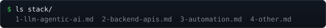

  <a href="https://github.com/MaithreshVaddi-27"><code>github.com/<b>MaithreshVaddi-27</b></code></a>

  
  
  
  
  

---

<table>
<tr>
<td width="55%" valign="top">

Final-year **B.Tech CSE** undergrad at KMIT Hyderabad, building **agentic RAG systems** — retrieval pipelines, MCP-based tool orchestration, multi-agent workflows — outside coursework.

10 solo repos, 13 automation workflows (n8n/Make.com/RPA), 2 group platforms with ML-integration ownership.

Currently hardening **TrustRAG**'s claim-verification loop and moving **CareerOS-Pro** toward Docker-based deployment.

**Working principles:**
- Simple beats clever — rebuilt DocuChat from multi-agent to single-agent once the complexity stopped paying off.
- Ship it, don't demo it — every project below is a maintained repo with a README, not a one-off notebook.

</td>
<td width="45%">

</td>
</tr>
</table>

---

**LLM / Agentic AI** — LangChain, LangGraph (StateGraph, adaptive recovery loops), RAG (hybrid dense + BM25 + RRF), Qdrant, ChromaDB, HuggingFace embeddings, MCP (Composio), CrewAI, ReAct/Plan-Execute agents, local LLMs (Ollama, llama.cpp)

**Backend / APIs** — FastAPI (async, JWT, rate limiting), Flask, MongoDB Atlas, Docker/Compose, Pydantic

**Automation** — n8n, Make.com, Automation Anywhere (RPA), REST APIs, Webhooks

<code>$ cat stack/other.md</code> — SQL, Git, Cloud, secondary frontend

 

- **SQL** — MySQL, SQLite; schema design, normalization, ACID transactions
- **Cloud/DevOps** *(coursework + labs)* — AWS (EC2, S3, Lambda, IAM), Kubernetes, Jenkins
- **Data** — Pandas, NumPy, Matplotlib
- **Frontend/general** *(not target role)* — React (Vite), Node.js/Express, Java, C++ — used for scaffolding on team projects

---

#### 🛡️ [TrustRAG — AI Reliability Workbench](https://github.com/MaithreshVaddi-27/TrustRAG)
**Solo · Production-oriented RAG reliability pipeline**

Hybrid retrieve → generate (grounded) → decompose claims → verify via NLI → audit evidence (SHA-256) → score reliability → diagnose failure & run bounded adaptive recovery (LangGraph query-rewrite → re-retrieve → re-verify) → grounded answer or explicit abstain.

FastAPI · React 18 · LangGraph · Qdrant · MongoDB Atlas · Docker · CI/CD

#### 🧠 [MCP Agentic DocuChat](https://github.com/MaithreshVaddi-27/MCP_Agentic_DocuChat)
**Solo · Agentic RAG for PDFs, with Gradio UI**

Per-question LLM choice (llama.cpp / Ollama / Gemini), switchable local/online embeddings, persistent SQLite history, response caching, multi-document query handling, Tavily web search via MCP when a question falls outside the document set. Deliberately pulled back from multi-agent to single-agent once the extra complexity stopped earning its keep.

LangChain · LangGraph · ChromaDB · Gradio · Composio MCP · Ollama · llama.cpp

#### 📋 [Resume Crew](https://github.com/MaithreshVaddi-27/Resume_Crew)
**Solo · Multi-agent CrewAI resume-JD matcher · CLI + Gradio**

Evidence-only match report (no invented skills/experience) from PDF/DOCX/TXT/Markdown inputs. Local-first (Ollama) with optional Gemini fallback. pytest coverage across scoring, storage, CLI, reports.

CrewAI · Ollama · Gemini · Gradio · pytest

#### 🧰 [CareerOS-Pro](https://github.com/MaithreshVaddi-27/CareerOS-Pro)
**Solo · Career-intelligence platform, in production hardening**

Aggregates listings from JSearch, Adzuna, Remotive, RemoteOK, Arbeitnow + a free scraper. Deterministic normalization, two-stage dedup, hard eligibility filters outside the LLM's control. LangGraph-routed multi-provider fallback chain (LlamaCpp → NVIDIA NIM → OpenRouter → Gemini). Two-stage link verification (HEAD check + Firecrawl scrape) — never invents a result.

Python · FastAPI · LangGraph · React 19 · Docker · pytest

<code>$ ls agents/more/</code>

 

- **[MCP SkillMap Agent](https://github.com/MaithreshVaddi-27/MCP_SkillMap_Agent)** — Skill-to-career mapping over live job data via Composio (Tavily + JSearch), LangGraph memory checkpointing.
- **[MCP SalaryInsights Agent](https://github.com/MaithreshVaddi-27/MCP_SalaryInsights_Agent)** — LangChain agent pulling live comp data (Glassdoor, AmbitionBox, PayScale, Levels.fyi) via Firecrawl MCP.
- **[AI Blog Writing Crew](https://github.com/MaithreshVaddi-27/Ai-Blog-Writer-Crew)** — 3-agent CrewAI pipeline, topic → edited blog post.
- **[AI Game Dev Crew](https://github.com/MaithreshVaddi-27/AI-Game-Dev-Crew)** — 3-agent CrewAI pipeline, idea → playable 2D browser game (WebAssembly via pygbag).
- **[MCP Email Inbox Summarizer](https://github.com/MaithreshVaddi-27/MCP_Email_Inbox_Summarizer)** — Gmail triage agent (URGENT/NEEDS REPLY/FYI), drafts only — never auto-sends.
- **[MCP CourseFinder Agent](https://github.com/MaithreshVaddi-27/MCP_CourseFinder_Agent)** — Merges Tavily + YouTube MCP results into one structured learning path.

---

**[Ai-Workflow-Automations](https://github.com/MaithreshVaddi-27/Ai-Workflow-Automations)** — 10 n8n workflows, 2 Make.com scenarios, 1 Automation Anywhere RPA bot, built across three platforms to learn where each earns its place. Exports in linked Drive folders; repo holds docs and diagrams.

**[PodEase Pro](https://podease-pro.lovable.app)**  — Idea-to-audio pipeline: Lovable frontend → n8n webhook → Gemini (script) → Murf AI (TTS).

---

**[CrimeSleuth](https://github.com/MaithreshVaddi-27/CrimeSleuth)** — Forensic case management, team of 4. My scope: trained a 14-class crime-scene classification model on Colab, exported as `.pth`, integrated for PyTorch inference in Flask alongside YOLO detection; outputs feed Gemini for auto-generated reports.
React · Flask · MongoDB · YOLO · Gemini

**[SignatureSense](https://github.com/MaithreshVaddi-27/SignatureSense)** — Handwritten signature verification, team of 4. My scope: integrated a pre-trained Keras/TensorFlow model for inference, image preprocessing, integration testing.
React · Node/Express · MongoDB · Flask · TensorFlow

---

**KMIT, Hyderabad** — B.Tech CSE, 2023–2027 · DSA, OS, DBMS, Computer Networks, Software Engineering, Cloud Computing (AWS), Cyber Security

---

---

  
  

  

