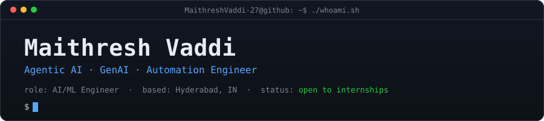
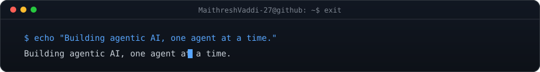

  <picture>
    <source media="(prefers-color-scheme: dark)" srcset="https://readme-typing-svg.demolab.com?font=Fira+Code&weight=500&size=18&pause=1400&color=58A6FF&background=00000000&center=true&vCenter=true&width=560&lines=I+build+agent+pipelines+that+ship%2C+not+slideware.">
    
  </picture>

  
  
  
  
  

<code>github.com/MaithreshVaddi-27</code> &nbsp;·&nbsp; Open to AI/ML, GenAI, Agentic AI &amp; Automation internships &nbsp;·&nbsp; Hyderabad / Remote

<a href="#about">About</a> &nbsp;·&nbsp; <a href="#stack">Stack</a> &nbsp;·&nbsp; <a href="#projects">Projects</a> &nbsp;·&nbsp; <a href="#automation">Automation</a> &nbsp;·&nbsp; <a href="#team-projects">Team Projects</a> &nbsp;·&nbsp; <a href="#education">Education</a> &nbsp;·&nbsp; <a href="#contact">Contact</a>

 

## About

<i>No inflated claims — everything below is something I can defend in an interview.</i>

<table>
<tr>
<td width="55%" valign="top">

I'm a final-year **B.Tech CSE** undergrad at KMIT Hyderabad (CGPA **7.96/10**), and most of what's below happened outside class — evenings and weekends spent on **agentic RAG architecture**: retrieval pipelines, MCP-based tool orchestration, multi-agent systems that route between reasoning and live data.

Ten of those are solo builds, shipped as standalone repos — not notebooks, not one-off demos. A production RAG reliability pipeline with a claim-verification loop. A CrewAI resume-matching tool with an actual pytest suite behind it. Thirteen n8n/Make.com/RPA workflows I built, broke, and fixed myself, which taught me more than the building did. Two group platforms too, where I owned the ML-integration layer.

Right now I'm hardening **TrustRAG**'s claim-verification and adaptive-recovery loop, and pushing **CareerOS-Pro** toward Docker-based production deployment with per-agent health monitoring.

</td>
<td width="45%">

</td>
</tr>
</table>

> **Simple beats clever.** I rebuilt DocuChat from a multi-agent system back down to one agent once the extra complexity stopped paying for itself.
>
> **Ship it, don't demo it.** Every project below is a real repo with a README, not a notebook I ran once.
>
> **If I can't defend it in an interview, it doesn't go on this page.**

<code>role: AI/ML · GenAI · Agentic AI Engineer</code> 
<code>based: Hyderabad, Telangana, IN</code> 
<code>status: open to internships</code>

<code>Qwen3-4B-GGUF, gemma3:4b — local, offline</code>

 

## Stack

**LLM / Agentic AI**

LangChain, LangGraph (StateGraph agentic workflows, adaptive recovery loops), RAG, hybrid retrieval (dense + BM25 sparse + RRF fusion), Qdrant, ChromaDB, HuggingFace Embeddings (`bge-base-en-v1.5`, `all-mpnet-base-v2`, `all-MiniLM-L6-v2`), MCP (Composio orchestration), CrewAI, AI Agents (ReAct / Plan-Execute), Conversational Memory/Checkpointing, Local LLMs (Ollama, llama.cpp, LM Studio), LoRA/RLHF fundamentals

**Backend / APIs**

FastAPI (async, JWT auth, rate limiting), Flask, httpx (async), Pydantic, MongoDB (Atlas), Docker / Docker Compose, SQLAlchemy

**Automation**

n8n, Make.com, Automation Anywhere (RPA), Webhooks, REST APIs

<b>SQL, Git &amp; Cloud/DevOps</b>

 

- **SQL** — MySQL, SQLite; schema design, joins, normalization to BCNF, ACID transactions, 15+ SQL problems solved on LeetCode
- **Git** — version control, branching workflows
- **Cloud/DevOps** *(coursework + hands-on labs, no named production deployment)* — AWS: EC2, EFS, EBS, VPC, S3, Lambda, SNS, SQS, Elastic Beanstalk, Lex, IAM, DynamoDB · Kubernetes, Jenkins — labs + self-practice
- **Data** — Pandas, NumPy, Matplotlib

<b>Secondary — frontend / general-purpose</b> (lower priority, not my target roles)

 

React (Vite), Node.js, Express.js, JavaScript, Java, C++ — used for full-stack scaffolding on team projects (CrimeSleuth, SignatureSense) and TrustRAG's frontend; not the direction I'm applying for.

 

## Projects

### [TrustRAG — AI Reliability Workbench](https://github.com/MaithreshVaddi-27/TrustRAG)
Solo-built · Local-first RAG reliability workbench · 219 backend + 22 frontend + 2 E2E tests passing

Standard RAG systems fail silently — grab some context, generate an answer, present it as fact, no audit trail. TrustRAG is a full reliability pipeline: hybrid retrieval (dense BGE-small-en-v1.5 + BM25 sparse + RRF fusion) → grounded generation → claim decomposition fused with NLI verification in a single call (`SUPPORTED`/`CONTRADICTED`/`NEUTRAL`) → SHA-256 integrity audit with temporal validity windows → reliability scoring (coverage × (1 − contradiction rate)) against configurable thresholds → on failure, one bounded LangGraph recovery round → grounded answer or explicit `ABSTAIN`. Runs 100% locally via Ollama or llama.cpp — no API keys required, documents never leave the machine; cloud models (Gemini, NVIDIA NIM) are opt-in, not required.

> The recovery step doesn't just retry blindly — it diagnoses *why* verification failed (missing evidence vs. thin evidence vs. already-sufficient evidence) and picks the matching fix: query rewrite, wider re-retrieval, or a free regenerate — bounded to one round so it can't loop forever.

Backed by a real CI/CD pipeline, not just a green badge: lint → test → config-validation → E2E (Playwright + k6) → Docker build with Trivy scanning on every push, plus a separate weekly dependency/secret/SAST security scan.

        

 

### [MCP Agentic DocuChat](https://github.com/MaithreshVaddi-27/MCP_Agentic_DocuChat)
Solo-built · My original agent-architecture project — now with a Gradio front end

Agentic RAG app for chatting with PDFs. What started as a CLI has grown a full Gradio interface on top of `rag_backend.py`: per-question choice of provider (llama.cpp local-default, Ollama, or Gemini), switchable local/online embeddings, persistent SQLite conversation history with automatic personal-fact capture, a size- and age-bounded response cache, and protected public share links. `retrieve_multi` handles compound multi-document questions; MCP tools (Composio) add live Tavily web search when a question falls outside the document set.

> Deliberately pulled back from an earlier multi-agent version to a lean single-agent design after the added complexity wasn't earning its keep — full agent-loop (retrieve → reason → tool-call → respond), not a LangChain quickstart wrapper.

      

 

### [Resume Crew](https://github.com/MaithreshVaddi-27/Resume_Crew)
Solo-built · Multi-agent CrewAI pipeline · CLI + Gradio UI

Compares a resume against a job description and produces an evidence-focused match report — no invented skills, no guessed experience. Runs entirely locally by default (Ollama) with optional Gemini cloud fallback. Accepts PDF, DOCX, TXT, and Markdown inputs across both the CLI and the Gradio web UI (with optional ngrok public sharing).

> Hardware auto-detection (Apple Silicon/GPU), telemetry-off-by-default, pytest coverage across scoring/storage/CLI/reports.

    

 

### [CareerOS-Pro](https://github.com/MaithreshVaddi-27/CareerOS-Pro)
Solo-built · Career-intelligence platform, actively in production hardening

Aggregates job/internship listings from JSearch, Adzuna, Remotive, RemoteOK, Arbeitnow, plus a free BeautifulSoup4 company-career-page scraper. Deterministic normalization and two-stage deduplication (URL hash → content hash) keep the LLM out of the parsing path; hard eligibility filters are pure logic the LLM can't override. A LangGraph state machine routes match-explanation across a multi-provider fallback chain (LlamaCpp → NVIDIA NIM → OpenRouter → Gemini), and every LLM provider and job-source adapter runs as a self-contained agent with health monitoring (`GET /agents/health`) so one failing source can't take the system down.

> Two-stage verification (HTTP HEAD check, then Firecrawl content scrape) — it never invents a result. React 19 + Vite frontend, Docker Compose deployment.

     

 

### [MCP SkillMap Agent](https://github.com/MaithreshVaddi-27/MCP_SkillMap_Agent)
Solo-built · Career-intelligence agent over live job data

Skill-to-career mapping agent using Composio (Tavily) + RapidAPI JSearch through MCP to research skill demand and pull live job listings, with LangGraph conversation-memory checkpointing for follow-up filtering.

   

<b>More agentic builds</b>

 

**[AI Blog Writing Crew](https://github.com/MaithreshVaddi-27/Ai-Blog-Writer-Crew)** — Solo · CrewAI · Gemini
Single-file 3-agent CrewAI pipeline (Content Strategist → Blog Writer → Editor) turns one topic into a finished, edited blog post saved as markdown.
`CrewAI` `Gemini`

**[AI Game Dev Crew](https://github.com/MaithreshVaddi-27/AI-Game-Dev-Crew)** — Solo · CrewAI · Pygame
3-agent CrewAI pipeline (Designer → Developer → QA) turns a one-line idea into a playable 2D browser game, packaged to WebAssembly via `pygbag` and shared via ngrok.
`CrewAI` `Gemini` `Pygame` `pygbag`

**[MCP SalaryInsights Agent](https://github.com/MaithreshVaddi-27/MCP_SalaryInsights_Agent)** — Solo · LangChain · Gemini
LangChain agent orchestrating Firecrawl MCP search-and-scrape tools (via Composio) to pull live compensation data from Glassdoor, AmbitionBox, PayScale, and Levels.fyi, with LangGraph conversation memory for multi-turn follow-ups.

**[MCP Email Inbox Summarizer](https://github.com/MaithreshVaddi-27/MCP_Email_Inbox_Summarizer)** — Gmail triage agent, classifies unread mail URGENT / NEEDS REPLY / FYI, drafts replies via Composio MCP. Read/draft only, never auto-sends.

**[MCP CourseFinder Agent](https://github.com/MaithreshVaddi-27/MCP_CourseFinder_Agent)** — Merges Tavily + YouTube MCP results into one structured learning path per topic; originally prototyped in Colab, now a clean local/terminal-runnable project.

 

## Automation

**[Ai-Workflow-Automations](https://github.com/MaithreshVaddi-27/Ai-Workflow-Automations)** — Solo · n8n · Make.com · Automation Anywhere
Consolidated collection of production-style automations built across three platforms on purpose, to learn where each one actually earns its place instead of forcing everything into one tool: **10 n8n workflows** (Internship Applier, LinkedIn Job Tracker, News Summarizer, Telegram Shopping Assistant with Groq Whisper voice input + Redis memory, Weather Daily Planner, Historical Content Publisher, Podcast Generator backend, Learning Journey Showcase, Social Media Automation, Learning Path Generator Agent), **2 Make.com scenarios** (Social Media Automation, Telegram Resume Evaluator), and **1 Automation Anywhere RPA bot** (Excel-driven email reminder system). Workflow exports live in linked Google Drive folders (redacted of keys/IDs); the repo holds documentation, diagrams, and screenshots.
`n8n` `Make.com` `Automation Anywhere` `Gemini` `Groq` `MurfAI` `SerpApi` `ScraperAPI` `OpenWeatherMap` `Redis`

**[AI Podcast Generator — PodEase Pro](https://podease-pro.lovable.app)** — Solo · n8n · Gemini API · Murf AI · Lovable &nbsp; 
Idea-to-published-audio pipeline. Lovable frontend triggers a webhook into n8n, which routes the topic through Gemini for script generation, then Murf AI for text-to-speech, returning the finished file via webhook response.
`n8n` `Gemini API` `Murf AI` `Webhooks`

 

## Team Projects

<b>CrimeSleuth</b> — AI-Powered Forensic Case Management — Team of 4

 

React (Vite) · Flask · MongoDB · YOLO · Gemini API

Investigators create cases, upload evidence, get computer-vision + multimodal AI analysis and an LLM chat interface over case data.

**My scope:** trained the 14-class crime-scene classification model myself on Colab, saved as `.pth`, loaded locally for PyTorch inference in Flask — integrated YOLO detection, outputs feed Gemini to auto-generate investigation reports.

[→ Repo](https://github.com/MaithreshVaddi-27/CrimeSleuth)

<b>SignatureSense</b> — Handwritten Signature Verification — Team of 4

 

React (Vite) · Node.js/Express · MongoDB · Flask · TensorFlow/Keras

Full-stack signature verification via image similarity.

**My scope:** integrated a pre-trained Keras/TensorFlow model (`.h5`) for inference, image preprocessing, integration testing, frontend fixes.

[→ Repo](https://github.com/MaithreshVaddi-27/SignatureSense)

<b>Other projects</b>

 

- **[MockInterview — GenAI Transcription System](https://github.com/MaithreshVaddi-27/MockInterview)** — Full-stack GenAI transcription platform (React + TypeScript frontend, Flask + PyTorch backend) with three modes: audio→text via a custom-trained Wav2Vec2+BERT-style model built from scratch, video→text via a custom multimodal model inspired by AV-HuBERT, and video→text via OpenAI Whisper. Each backend runs as a standalone Flask service; Firebase auth on the frontend.
- **[F5-TTS Podcast Generator](https://github.com/MaithreshVaddi-27/F5-tts-podcast-generator)** — Reproducible Kaggle notebook, F5-TTS voice cloning, Gradio inference UI.
- **Amazon E-commerce EDA** — Cleaned `discount_percentage` field, groupby/nlargest analysis, Matplotlib visuals.
- **[FoodMunch](https://github.com/MaithreshVaddi-27/FoodMunch)** — Responsive restaurant landing page, HTML/CSS/Bootstrap. *(frontend — low priority, kept for completeness)*

 

## Education

**Keshav Memorial Institute of Technology (KMIT)** — B.Tech CSE, 2023–2027, CGPA 7.96/10, Hyderabad
Coursework: DSA, Operating Systems, DBMS (MySQL), Computer Networks, Software Engineering, Cloud Computing (AWS), Cyber Security

 

## Activity

 

## Contact

<i>Let's build something that ships.</i>

Open to AI/ML, GenAI, Agentic AI, and Automation internship roles. Based in Hyderabad — happy to go remote.

  
  
  
  
  

+91 70752 98432 &nbsp;·&nbsp; Hyderabad, Telangana, IN

  

